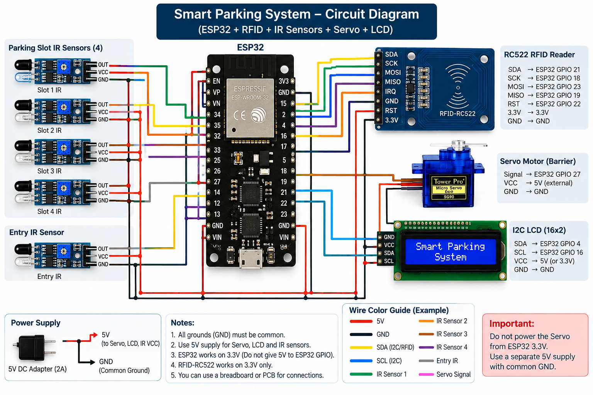

# \# Smart Parking System

# 

# ESP32 + RC522 RFID + 3 Parking IR Sensors + Entry IR + Servo Barrier + I2C LCD + Flask Dashboard.

# 

# \## System Block Diagram

# 

# 

# &#x20; 

# 

# 

# \## 1. Flask Server

# 

# Open a terminal in this folder:

# 

# &#x20;   python -m venv venv

# 

# \### Windows

# 

# &#x20;   venv\\Scripts\\activate

# 

# \### Linux/macOS

# 

# &#x20;   source venv/bin/activate

# 

# Install the required Python packages:

# 

# &#x20;   pip install -r requirements.txt

# 

# Run the Flask server:

# 

# &#x20;   python app.py

# 

# The dashboard will be available at:

# 

# &#x20;   http://127.0.0.1:5000

# 

# For another computer or phone on the same Wi-Fi:

# 

# &#x20;   http://YOUR\_PC\_IP:5000

# 

# Find the PC IP with:

# 

# &#x20;   ipconfig

# 

# on Windows, or:

# 

# &#x20;   ip addr

# 

# on Linux.

# 

# \## 2. ESP32

# 

# Install these Arduino libraries:

# 

# \- MFRC522

# \- LiquidCrystal\_I2C

# \- ESP32Servo

# 

# Configure these values in the ESP32 code:

# 

# &#x20;   WIFI\_SSID

# &#x20;   WIFI\_PASSWORD

# &#x20;   FLASK\_SERVER

# 

# Example:

# 

# &#x20;   const char\* FLASK\_SERVER = "192.168.1.100";

# 

# This must be the LAN IP address of the computer running Flask.

# 

# \## 3. Hardware Configuration

# 

# \### Parking Slots

# 

# The system uses three parking slots:

# 

# \- Slot 2

# \- Slot 3

# \- Slot 4

# 

# Each slot uses an IR sensor to detect whether the slot is occupied.

# 

# \### Pin Configuration

# 

# | Component | ESP32 GPIO |

# |---|---:|

# | Slot 2 IR | GPIO 35 |

# | Slot 3 IR | GPIO 32 |

# | Slot 4 IR | GPIO 33 |

# | Entry IR | GPIO 25 |

# | RC522 SDA/SS | GPIO 21 |

# | RC522 RST | GPIO 22 |

# | RC522 SCK | GPIO 18 |

# | RC522 MISO | GPIO 19 |

# | RC522 MOSI | GPIO 23 |

# | Servo | GPIO 27 |

# | LCD SDA | GPIO 4 |

# | LCD SCL | GPIO 16 / RX2 |

# 

# The I2C LCD uses address:

# 

# &#x20;   0x27

# 

# \## 4. RFID Authorization

# 

# The system checks the UID of every scanned RFID card against the authorized RFID list.

# 

# To add or replace an RFID card, update the authorized card list in the ESP32 code.

# 

# Open Serial Monitor at 115200 baud and scan the card. The UID will be printed.

# 

# \## 5. LCD Display States

# 

# The LCD provides feedback during the parking process.

# 

# | Situation | LCD Display |

# |---|---|

# | Normal / waiting | `SCAN RFID` |

# | RFID recognized + slot available | `ACCESS GRANTED` |

# | Barrier opening | `GATE OPEN` |

# | Vehicle passing | `DRIVE THROUGH` |

# | Vehicle passed | `GATE CLOSING` |

# | RFID not authorized | `ACCESS DENIED` |

# | No parking available | `PARKING FULL` |

# 

# \## 6. IR Sensors

# 

# The code assumes the IR modules are ACTIVE LOW:

# 

# &#x20;   LOW  = vehicle/object detected

# &#x20;   HIGH = clear

# 

# If your modules behave in the opposite way, change:

# 

# &#x20;   const bool IR\_ACTIVE\_LOW = true;

# 

# to:

# 

# &#x20;   const bool IR\_ACTIVE\_LOW = false;

# 

# \## 7. Important Electrical Notes

# 

# RC522 must be powered from 3.3 V.

# 

# ESP32 GPIOs are not 5 V tolerant. Do not connect a 5 V IR output directly to an ESP32 GPIO.

# 

# The servo should use an external 5 V supply.

# 

# Connect the servo supply GND to ESP32 GND to maintain a common ground.

# 

# If the I2C LCD backpack uses 5 V pull-ups, use a suitable level shifter or otherwise ensure SDA/SCL never exceed 3.3 V at the ESP32.

# 

# \## 8. System Flow

# 

# &#x20;   RFID scanned

# &#x20;         ↓

# &#x20;   UID checked

# &#x20;         ↓

# &#x20;   ┌─────────────────────────┐

# &#x20;   │ Authorized RFID?        │

# &#x20;   └─────────────────────────┘

# &#x20;         ↓ Yes

# &#x20;   Check available slots

# &#x20;         ↓

# &#x20;   ┌─────────────────────────┐

# &#x20;   │ Parking available?      │

# &#x20;   └─────────────────────────┘

# &#x20;      ↓ Yes          ↓ No

# &#x20;   Access Granted   Parking Full

# &#x20;      ↓

# &#x20;   Gate Opens

# &#x20;      ↓

# &#x20;   Entry IR detects vehicle

# &#x20;      ↓

# &#x20;   DRIVE THROUGH

# &#x20;      ↓

# &#x20;   Vehicle clears Entry IR

# &#x20;      ↓

# &#x20;   Gate Closing

# &#x20;      ↓

# &#x20;   Gate Closed

# &#x20;      ↓

# &#x20;   SCAN RFID

# 

# \## 9. Flask Dashboard

# 

# The Flask dashboard displays the current parking status and barrier information.

# 

# The ESP32 sends parking and gate information to:

# 

# &#x20;   POST /api/update

# 

# The dashboard retrieves the latest system status through:

# 

# &#x20;   GET /api/status

# 

# The dashboard polls the status endpoint every second.

# 

# \## 10. Data Sent by ESP32

# 

# The ESP32 sends information including:

# 

# \- Slot 2 occupancy

# \- Slot 3 occupancy

# \- Slot 4 occupancy

# \- Entry status

# \- Barrier status

# \- Vehicle detection

# \- Last RFID UID

# \- Last authorized user

# 

# \## 11. Project Structure

# 

# &#x20;   smart\_parking\_system/

# &#x20;   │

# &#x20;   ├── app.py

# &#x20;   ├── index.html

# &#x20;   ├── requirements.txt

# &#x20;   ├── README.md

# &#x20;   ├── block-diagram.png

# &#x20;   │

# &#x20;   ├── smart\_parking/

# &#x20;   │   └── smart\_parking.ino

# &#x20;   │

# &#x20;   └── templates/

# &#x20;       └── ...

# 

# \## 12. Running the Project

# 

# \### Start Flask

# 

# &#x20;   python app.py

# 

# \### Upload ESP32 Code

# 

# 1\. Open the `.ino` file in Arduino IDE.

# 2\. Select the ESP32 board.

# 3\. Select the correct COM port.

# 4\. Upload the code.

# 5\. Open Serial Monitor at 115200 baud.

# 

# \### Open Dashboard

# 

# On the PC:

# 

# &#x20;   http://127.0.0.1:5000

# 

# From another device on the same network:

# 

# &#x20;   http://YOUR\_PC\_IP:5000

